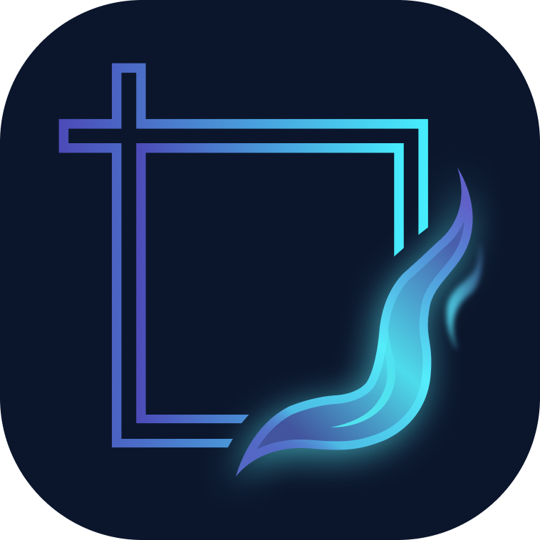
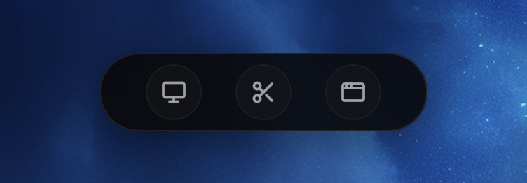
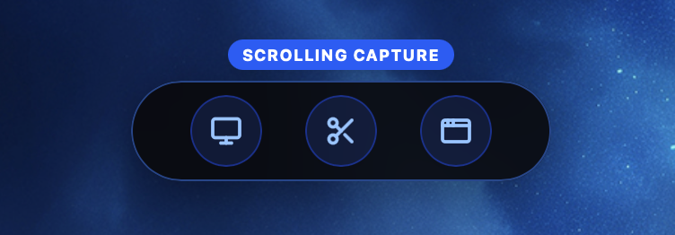
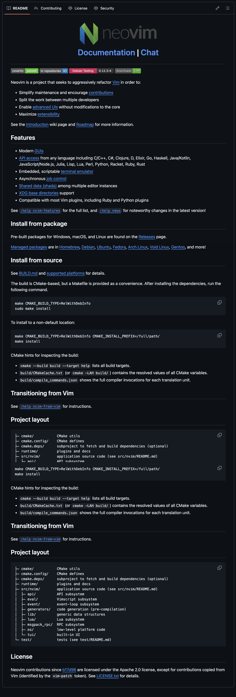
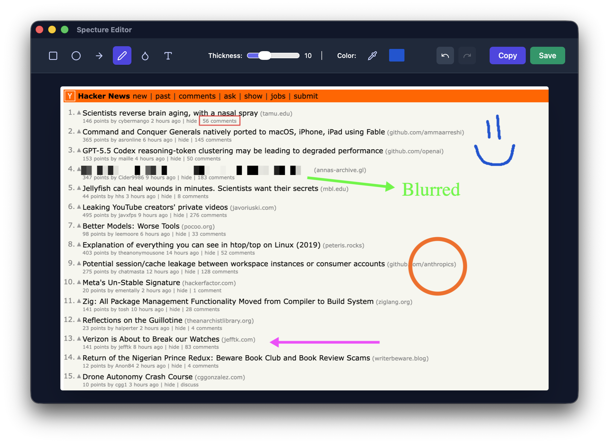
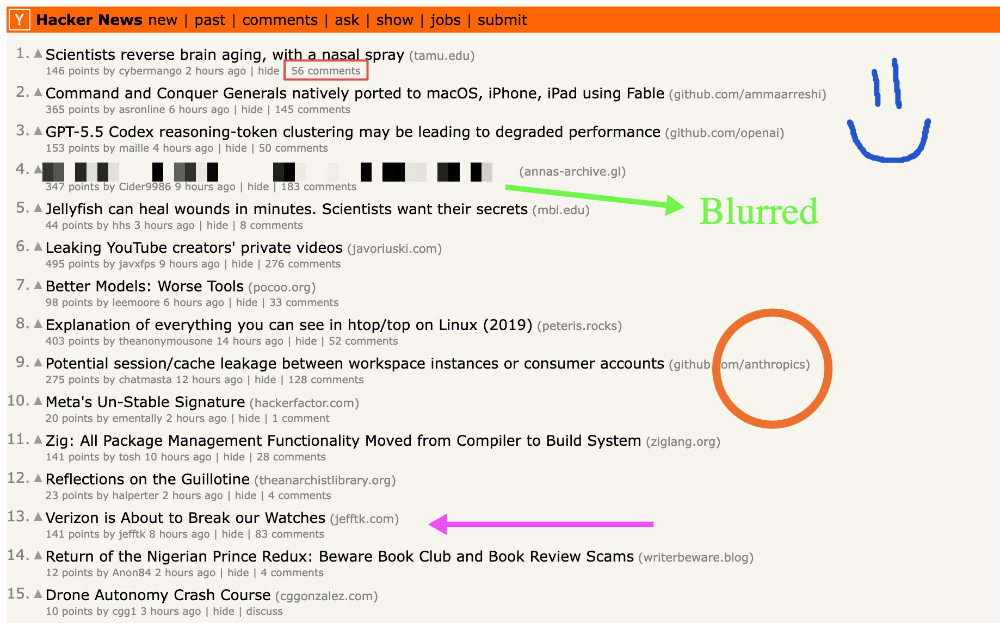

<div align="center">
  
  <h1>Specture</h1>
  <p><strong>A fast, powerful, and beautiful cross-platform screenshot tool built with Tauri & React.</strong></p>
</div>

## About Specture
Specture is a modern screenshot utility designed to be lightweight, incredibly fast, and unobtrusive. Whether you need to capture a specific window, a region, your entire screen, or even a scrolling webpage, Specture handles it all with ease. Designed for both macOS and Windows/Linux, it lives directly in your system tray and responds instantly to global keyboard shortcuts.

### ✨ Key Features
- **Multiple Capture Modes**: Full Screen, Region, Window, and long Scrolling Capture.
- **Built-in Editor**: Annotate your screenshots instantly with arrows, rectangles, circles, freehand drawing, blur (obfuscation), text, and a realistic highlighter. No separate windows—editing happens completely in-place via a floating toolbar. You can even select and edit the properties (color, thickness, font) of existing annotations!
- **Scrolling Capture**: Seamlessly capture long websites or documents with automated scrolling and stitching.
- **System Tray Integration**: Quietly runs in the background. Access your settings and capture modes with a single click.
- **Multi-language Support**: Available in English, Brazilian Portuguese (`pt-BR`), and Spanish (`es`).
- **Color Space Customization**: Choose between Auto, sRGB, and Display P3 for absolute color accuracy on Mac and other displays.
- **Auto-save & Clipboard**: Automatically copies captures to your clipboard and optionally saves them directly to your specified folder.

---

## 📸 Screenshots

| Feature / Menu | Screenshot |
| :--- | :--- |
| **Control Panel**<br>The minimalist area selector for choosing your capture mode. | <a href="docs/assets/control_panel.png" target="_blank"></a> |
| **Scrolling Capture (Selection)**<br>Selecting the region before the auto-scroll begins. | <a href="docs/assets/scrolling_capture_selection.png" target="_blank"></a> |
| **Scrolling Capture (Result)**<br>A long, seamlessly stitched webpage. <br><br>*(Click to view full 5000+ px size)* | <a href="docs/assets/scrolling_capture_output.png" target="_blank"></a> |
| **In-Place Editor**<br>Instantly annotate with arrows, blur, text, highlighters, and freehand drawing using the floating toolbar directly on your screen. | <a href="docs/assets/specture_editor.png" target="_blank"></a> |
| **Final Result**<br>the high-quality output after saving from the editor. | <a href="docs/assets/specture_screenshot.png" target="_blank"></a> |

---

## 📥 Installation

Specture can be installed on macOS via Homebrew or manually via direct download. 

### Option 1: Install via Homebrew (macOS)
```bash
brew install azeveco/tap/specture
```

### Option 2: Direct Download (macOS, Windows, Linux)
1. Go to the [Releases page](https://github.com/azeveco/specture/releases) on GitHub.
2. Download the appropriate bundle for your operating system (e.g., `.dmg` or `.app` for macOS, `.exe` for Windows).
3. Open the installer and follow the instructions.

#### macOS: "App is damaged" or "Developer cannot be verified"
If you download the `.dmg` or `.app` directly (instead of using Homebrew) and the app is not yet signed with an Apple Developer ID, macOS Gatekeeper may block it from launching. You have two ways to fix this:

**Option A (Terminal - Recommended):**
Run this command to remove the quarantine attribute:
```bash
xattr -cr /Applications/Specture.app
```

**Option B (System Settings):**
1. Attempt to open the app. When you see the warning, click **OK**.
2. Open **System Settings > Privacy & Security**.
3. Scroll down to the Security section, find the message saying Specture was blocked, and click **Open Anyway**.

---

## ⌨️ Global Shortcuts

Specture is built for speed. By default, it registers these global shortcuts so you can capture anything without opening the app first. You can customize all of them in the **Settings** menu.

> Note: On Windows and Linux, Command and Option keys are mapped to Ctrl and Alt respectively.

| Action | Default Shortcut (macOS) |
| --- | --- |
| **Capture Full Screen** | `Command + Option + 3` |
| **Capture Region** | `Command + Option + 4` |
| **Capture Window** | `Command + Option + 5` |
| **Scrolling Capture** | `Command + Option + 6` |
| **Open Control Panel** | `Command + Option + 7` |

> **Note**: To change a shortcut, right-click the Specture icon in your System Tray, open **Settings**, and click on the shortcut field.

### Editor Shortcuts
When you are in the annotation window, you can use these shortcuts to speed up your workflow:

| Action | Shortcut |
| --- | --- |
| **Select Tools** | `1` (Select), `2` (Rect), `3` (Circle), `4` (Arrow), `5` (Freehand), `6` (Blur), `7` (Text), `8` (Highlighter), `9` (Eraser) |
| **Straight Lines / Proportions** | Hold `Shift` while creating or editing shapes (Arrow snapping, perfect square/circle) |
| **Change Brush Thickness (or Font Size if not typing)** | `[` to decrease, `]` to increase |
| **Change Text Font Size (while typing)** | `Command + [` and `Command + ]` |
| **Color Menu** | `Right Click anywhere on the screenshot` |
| **Color Picker (Eyedropper)** | `Command + Click` (or `Ctrl + Click`) anywhere on the image |
| **Undo** | `Command + Z` |
| **Redo** | `Command + Y` (or `Command + Shift + Z`) |
| **Copy to Clipboard** | `Command + C` |
| **Delete Selected Annotation** | `Backspace` or `Delete` |
| **Save Image** | `Command + S` |
| **Cancel / Deselect** | `Esc` |

---

## ❓ FAQ

**1. Why do the colors on my screenshots look washed out or too saturated?**
Depending on your monitor (especially on Apple devices with wide color gamuts), the default color interpretation might differ. Go to **Settings > Advanced** and change the **Color Space Mode** to `Display P3` (recommended for modern Macs) or `sRGB`.

**2. Where do my screenshots go?**
By default, Specture copies the screenshot directly to your clipboard. If you want them saved to your disk automatically, open **Settings > Save Options** and set a `Default Save Location`. You can also configure the naming convention.

**3. The Scrolling Capture didn't capture the whole page. What happened?**
Scrolling capture relies on taking multiple screenshots while simulating scrolling. To ensure a perfect capture:
1. Trigger the scrolling capture shortcut and select the region.
2. Specture will begin scrolling automatically. **Leave your mouse completely still** inside the scrolling window and wait for the process to finish.
3. If it cuts off too early, you can adjust the `Max Recording Duration` in the **Settings**.

**4. How do I stop a Scrolling Capture early?**
You can stop the automated scrolling manually at any time by:
- Pressing the Scrolling Capture shortcut again (`Cmd + Option + 6`)
- Clicking the red `Stop` icon in your system tray
- Clicking the floating Stop button (if you have it enabled in Settings).

**5. My screenshots are only capturing the desktop wallpaper, not my application windows. What is happening?**
This is a macOS privacy protection feature. If Specture does not have explicit **Screen Recording** permission, macOS will hide all application windows and only allow the app to see your bare desktop wallpaper.
If the system didn't automatically prompt you for this permission when you opened the app:
1. Open your Mac's **System Settings**.
2. Go to **Privacy & Security** > **Screen & System Audio Recording**.
3. Click the **`+`** button at the bottom of the list.
4. Navigate to your `Applications` folder and select `Specture` to add it manually.
5. Ensure the toggle next to Specture is turned **ON**. (If it's already there but not working, select it, click the `-` button to remove it, and then add it again).

---

## 🛠️ Development

Want to build Specture from source? 

1. Ensure you have [Node.js](https://nodejs.org/) and [Rust](https://rustup.rs/) installed.
2. Clone the repository:
   ```bash
   git clone https://github.com/your-username/specture.git
   cd specture
   ```
3. Install dependencies:
   ```bash
   npm install
   ```
4. Run the development server:
   ```bash
   npm run tauri dev
   ```

## 📝 License

This project is licensed under the MIT License. See the [LICENSE](LICENSE) file for details.
